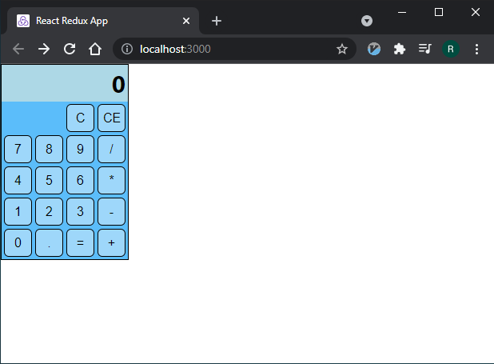
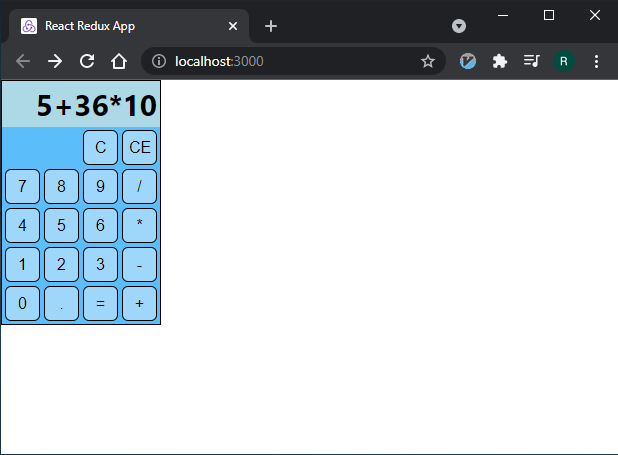
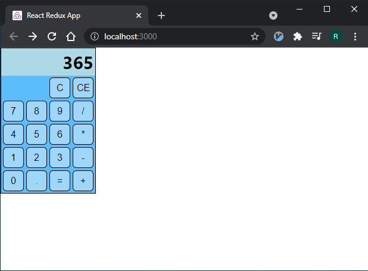
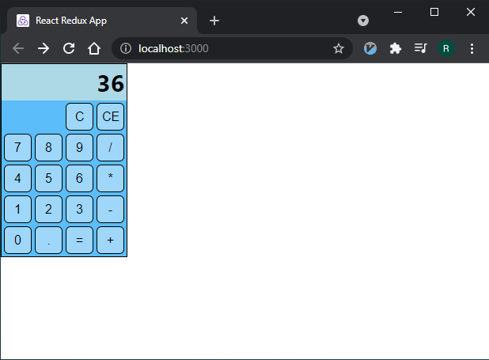
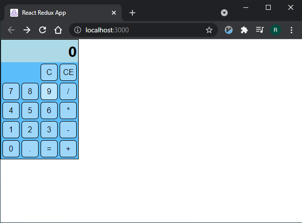

# ces26serie06 - Relatório
### Aluno: Ricardo Macedo Pacheco

___

Figura 1: Página da calculadora logo após ser aberta.

_nota: o estado interno do visor é a string vazia "", porém o visor imprime "0" para esse estado em especifico._
___

Figura 2: Logo após inserir uma expressão clicando nos botões.
___

Figura 3: O botão "=" faz uma evaluação da expressão inserida utilizando a lib mathjs. Note que a precedência aritmética usual é obedecida.
___

Figura 4: O botão "CE" apaga o primeiro caractere a direita

_nota: funciona mesmo se o estado for a string vazia, nesse caso não faz nada._
___

Figura 5: O botão "C" apaga o visor. Mais precisamente, seta o estado interno como a string vazia
___

Figura 6: Bonus: os botões mudam a cor ao clicar, e após soltar realizam uma transição de 300ms para a cor original.

Para executar:

    $ npm start

